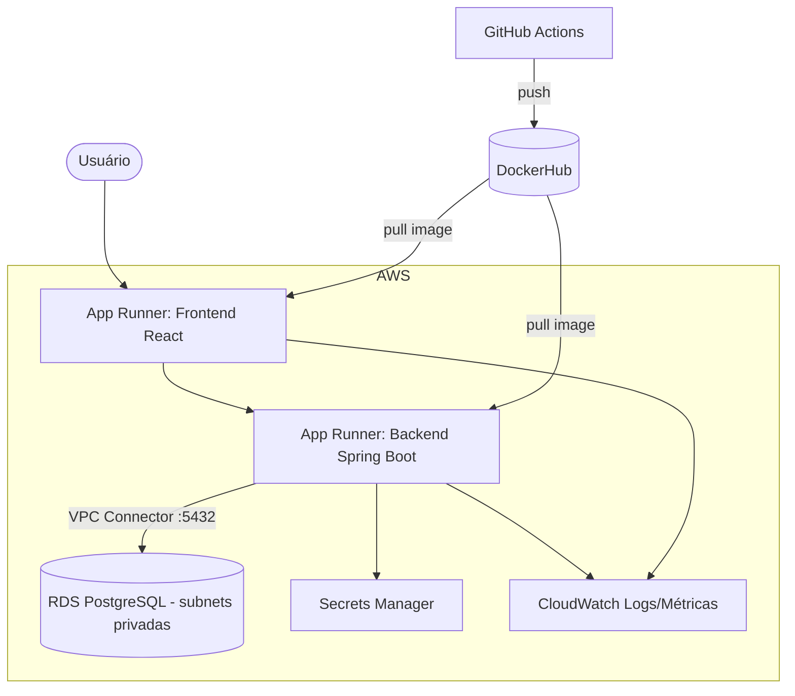

# C4 — Nível Container

```mermaid
flowchart TB
    user([Usuário]) --> fe[App Runner: Frontend React]
    fe --> be[App Runner: Backend Spring Boot]
    be -->|VPC Connector :5432| db[(RDS PostgreSQL - subnets privadas)]
    be --> sm[Secrets Manager]
    be --> cw[CloudWatch Logs/Métricas]
    fe --> cw
    subgraph AWS
      fe
      be
      db
      sm
      cw
    end
    gh[GitHub Actions] -->|push| dh[(DockerHub)]
    dh -->|pull image| fe
    dh -->|pull image| be
```
