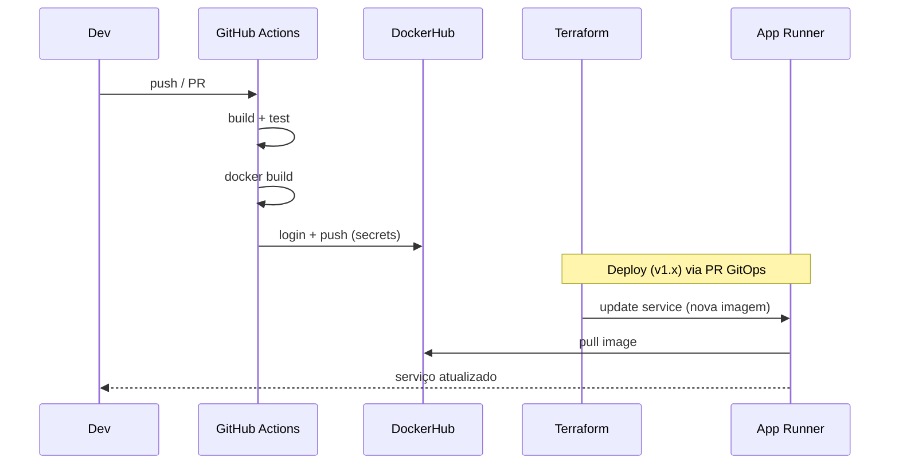

# Fluxo de CI/CD

```mermaid
sequenceDiagram
    participant Dev
    participant GH as GitHub Actions
    participant DH as DockerHub
    participant TF as Terraform
    participant AR as App Runner
    Dev->>GH: push / PR
    GH->>GH: build + test
    GH->>GH: docker build
    GH->>DH: login + push (secrets)
    Note over TF,AR: Deploy (v1.x) via PR GitOps
    TF->>AR: update service (nova imagem)
    AR->>DH: pull image
    AR-->>Dev: serviço atualizado
```
